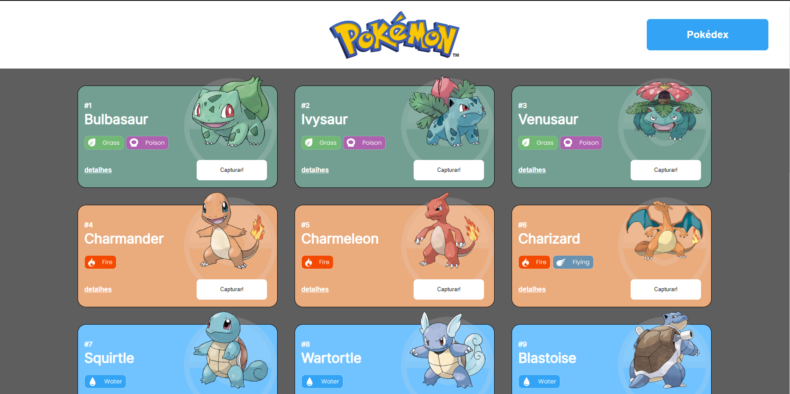
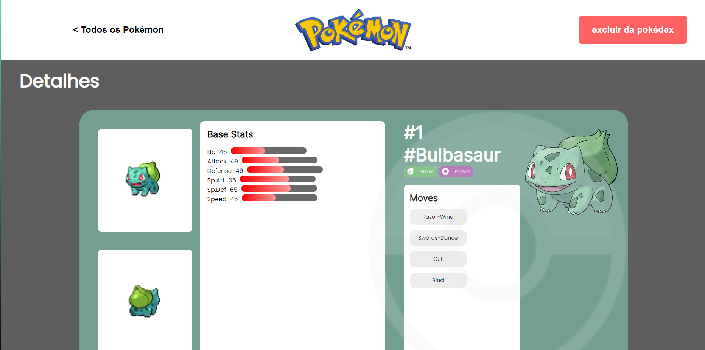

# Projeto React e Api's- Pokédex

O Projeto React e APIs é um site de pokémons que possui três páginas: Home, Pokedex e Detalhes.

É objetivo deste projeto criar um site com três páginas usando a Poke Api com as seguintes ferramentas:

- [React](https://react.dev)
- [React Router](https://reactrouter.com/en/main)
- [Styled-components](https://styled-components.com)
- [React Context](https://legacy.reactjs.org/docs/context.html)
- [Axios](https://axios-http.com/ptbr/docs/intro)

## Funcionalidades

- [x] Visualizar os pokemon disponiveis
- [x] Adicionar e remover o pokemon da pokedex
- [x] Visualizar detalhes do pokemon selecionado

## Layout

## Demonstração

[Link demonstração](https://pokedex-arthur-jordi.surge.sh)
